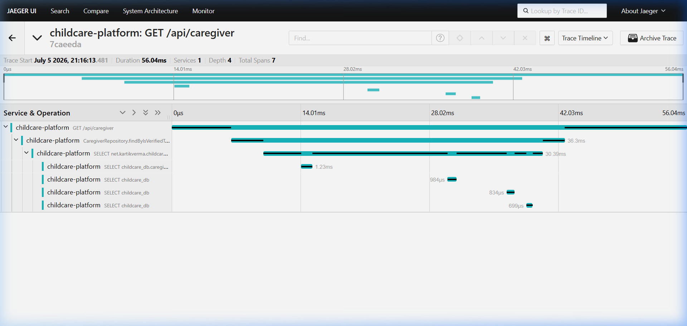
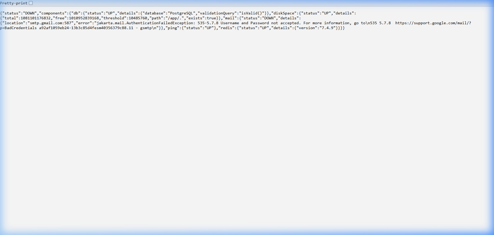

<p align="center">
  
  
  
  
  
  
</p>

<p align="center">
  <a href="https://github.com/Kartik-Verma-Nnl/childcare-platform/actions/workflows/build.yml">
    
  </a>
  
</p>

# 🧒 Childcare Platform — Backend API

A **production-grade** evening childcare matching platform built with **Spring Boot**. It connects **parents** looking for trusted evening childcare with **verified caregivers**, powered by real-time chat, event-driven notifications, and a full observability stack.

---

## 📑 Table of Contents

- [Features](#-features)
- [Tech Stack](#-tech-stack)
- [Architecture](#-architecture)
- [Screenshots](#-screenshots--live-demo)
- [Getting Started](#-getting-started)
- [API Endpoints](#-api-endpoints)
- [Database Schema](#-database-schema)
- [Observability](#-observability)
- [CI/CD](#-cicd)
- [Project Structure](#-project-structure)
- [Environment Variables](#-environment-variables)
- [Contributing](#-contributing)

---

## ✨ Features

| Category | Details |
|---|---|
| **🔐 Authentication** | JWT-based stateless auth with BCrypt password hashing. Role-based access control (Parent / Caregiver / Admin) |
| **👶 Booking System** | Full booking lifecycle — create, accept, cancel, complete. Live session status tracking (NOT_STARTED → IN_PROGRESS → COMPLETED) |
| **🔍 Caregiver Search** | Parents can search caregivers by **city** and **date** with paginated results |
| **💬 Real-Time Chat** | WebSocket (STOMP) powered chat between parent and caregiver per booking |
| **⭐ Reviews & Ratings** | Parents can review caregivers after completed bookings. Auto-computed average rating |
| **📧 Email Notifications** | Kafka-driven async email notifications on booking events (created, confirmed, cancelled, completed) |
| **🛡️ Admin Panel** | Verify/unverify caregivers, view all users and bookings with pagination |
| **⚡ Caching** | Redis caching for caregiver listings to reduce DB load |
| **📊 Observability** | Full-stack monitoring: Prometheus + Grafana (metrics), ELK (logs), Jaeger + OpenTelemetry (traces) |
| **📖 API Documentation** | Interactive Swagger UI with OpenAPI 3.0 spec and JWT auth support |

---

## 🛠 Tech Stack

### Core
| Technology | Purpose |
|---|---|
| **Spring Boot 3.2.5** | Application framework |
| **Java 17** | Language runtime |
| **Spring Security** | Authentication & authorization |
| **Spring Data JPA** | Database ORM |
| **Spring Validation** | Request validation |
| **Lombok** | Boilerplate reduction |

### Data & Messaging
| Technology | Purpose |
|---|---|
| **PostgreSQL 15** | Primary relational database |
| **Redis 7** | Caching layer |
| **Apache Kafka** | Event-driven messaging for booking notifications |
| **Spring WebSocket (STOMP)** | Real-time bidirectional chat |

### Observability
| Technology | Purpose |
|---|---|
| **Prometheus** | Metrics collection |
| **Grafana** | Metrics visualization & dashboards |
| **Elasticsearch** | Log storage & indexing |
| **Kibana** | Log visualization & search |
| **Filebeat** | Log shipping to Elasticsearch |
| **Jaeger** | Distributed tracing UI |
| **OpenTelemetry** | Auto-instrumentation for traces |
| **Micrometer** | Metrics bridge for Spring Boot |

### DevOps
| Technology | Purpose |
|---|---|
| **Docker & Docker Compose** | Containerized deployment |
| **GitHub Actions** | CI/CD pipeline |
| **SpringDoc OpenAPI** | Swagger UI & API docs |

---

## 🏗 Architecture

```
┌─────────────────┐        ┌─────────────────┐        ┌─────────────────┐
│   Parent App    │        │  Caregiver App  │        │ Admin Dashboard │
└────────┬────────┘        └────────┬────────┘        └────────┬────────┘
         │                          │                          │
         └──────────────────────────┼──────────────────────────┘
                                    │
                           ┌────────▼────────┐
                           │   Spring Boot   │
                           │    REST API     │ ──── JWT Authentication
                           │   (Port 8080)   │ ──── WebSocket (STOMP)
                           └────┬───────┬────┘
                                │       │
     ┌──────────────────────────┴───────┴────────────────────────┐
     │            │                             │                │
┌────▼────┐  ┌────▼────┐                   ┌────▼────┐  ┌────▼────┐
│Postgres │  │  Redis  │                   │  Kafka  │  │  Email  │
│   SQL   │  │  Cache  │                   │ Broker  │  │ (SMTP)  │
└─────────┘  └─────────┘                   └─────────┘  └─────────┘

          ┌───────── Observability Stack ─────────┐
          │                                       │
    ┌─────▼─────┐          ┌─────▼─────┐          ┌─────▼─────┐
    │Prometheus │          │    ELK    │          │ Jaeger +  │
    │ & Grafana │          │   Stack   │          │ OpenTele  │
    └───────────┘          └───────────┘          └───────────┘
```

---

## 📸 Screenshots — Live Demo

> All screenshots below are taken from the **live running application** with all 11 Docker containers active.

### 🐳 Docker Containers — All 11 Services Running

All infrastructure services orchestrated via a single `docker compose up -d --build` command:

```
NAMES                     STATUS          PORTS
childcare-app             Up 29 minutes   0.0.0.0:8080->8080/tcp
childcare-grafana         Up 29 minutes   0.0.0.0:3000->3000/tcp
childcare-kibana          Up 29 minutes   0.0.0.0:5601->5601/tcp
childcare-filebeat        Up 29 minutes
childcare-kafka           Up 29 minutes   0.0.0.0:9092->9092/tcp
childcare-jaeger          Up 29 minutes   0.0.0.0:4317-4318->4317-4318/tcp, 0.0.0.0:16686->16686/tcp
childcare-prometheus      Up 29 minutes   0.0.0.0:9090->9090/tcp
childcare-postgres        Up 29 minutes   0.0.0.0:5432->5432/tcp
childcare-elasticsearch   Up 29 minutes   0.0.0.0:9200->9200/tcp
childcare-redis           Up 29 minutes   0.0.0.0:6379->6379/tcp
childcare-zookeeper       Up 29 minutes   2181/tcp
```

---

### 📖 Swagger UI — Interactive API Documentation
> Access at `http://localhost:8080/swagger-ui/index.html`

The Swagger UI provides a fully interactive API explorer with **OpenAPI 3.0** specification. It lists all controllers — **Caregiver**, **Booking**, **Auth**, **Chat**, **Review**, **Admin**, and **Parent** — with JWT authorization support via the **Authorize** button.


**Key highlights:**
- Complete REST API documentation with request/response schemas
- JWT Bearer token authentication support via the "Authorize" button
- Server URL auto-detection (`http://localhost:8080`)
- Try-it-out functionality for testing endpoints directly

---

### 🔍 Jaeger — Distributed Tracing (Trace Search)
> Access at `http://localhost:16686`

Jaeger captures **all distributed traces** from the application using **OpenTelemetry auto-instrumentation**. The screenshot shows the search view with the `childcare-platform` service selected, displaying **20 traces** including API calls like `GET /api/caregiver`, `POST /api/auth/register`, `GET /v3/api-docs`, and Prometheus scrape requests (`GET /actuator/prometheus`).


**Key highlights:**
- Service auto-discovery via OpenTelemetry Java Agent
- Duration scatter plot showing trace latencies over time
- 32 operations tracked across REST endpoints, Swagger, and Actuator
- Sort by Most Recent, Duration, or download results

---

### 🔍 Jaeger — Distributed Tracing (Trace Detail)

Clicking into a specific trace reveals the **full span waterfall** — showing the exact execution path of a `GET /api/caregiver` request with **7 spans** across **4 depth levels**. The trace breaks down the 56ms request into individual operations: HTTP handler → JPA Repository (`CaregiverRepository.findByIsVerified`) → SQL queries (`SELECT childcare_db`).



**Key highlights:**
- Full span waterfall with timing breakdown for each operation
- 7 spans showing HTTP → JPA → SQL query execution path
- Individual span durations visible (36.3ms for repository call, ~1ms per SQL query)
- Trace metadata: Service count, total depth, and total span count

---

### 📈 Prometheus — Metrics Query Engine
> Access at `http://localhost:9090`

Prometheus scrapes **Spring Boot Actuator metrics** every 5 seconds. The screenshot shows a live graph of `jvm_memory_used_bytes` — tracking JVM heap and non-heap memory usage across different memory pools (G1 Eden, G1 Old Gen, Metaspace, CodeCache, etc.).


**Key highlights:**
- Real-time JVM memory monitoring with ~160MB heap usage visible
- Multiple memory pool series graphed (Eden, Old Gen, Survivor, Metaspace)
- 1-hour time window with auto-refresh
- PromQL query support for ad-hoc metric exploration
- Scraping from `/actuator/prometheus` endpoint every 5s

---

### 📊 Grafana — Metrics Visualization & Dashboards
> Access at `http://localhost:3000` (admin/admin)

Grafana provides a powerful **dashboard builder** that connects to Prometheus for visualizing application and infrastructure metrics. The screenshot shows the Grafana home page after login, ready to connect data sources and build custom dashboards.


**Key highlights:**
- Pre-configured with Prometheus data source connectivity
- Dark theme with professional dashboard UI
- Supports custom dashboards for JVM metrics, HTTP request rates, error rates, and business KPIs
- Alert rules for proactive monitoring
- Built-in tutorials for Data Sources and Dashboard creation

---

### 📋 Kibana — Log Analytics (ELK Stack)
> Access at `http://localhost:5601`

Kibana provides **centralized log management** via the ELK stack (Elasticsearch + Filebeat + Kibana). The screenshot shows the **Discover** view with the `childcare-logs` data view, displaying **1,236 structured log documents** shipped from the application via Filebeat. Logs include fields like `level`, `application`, `host.name`, `@timestamp`, and more.


**Key highlights:**
- **1,236 log documents** ingested and indexed in Elasticsearch
- 26 available fields for filtering and analysis (level, application, host.name, trace_id, etc.)
- Histogram visualization showing log volume over time
- KQL (Kibana Query Language) support for powerful log filtering
- Structured JSON logging via `logstash-logback-encoder`
- Filebeat auto-ships application logs from `./logs/` directory

---

### 🏥 Spring Boot Actuator — Health Check
> Access at `http://localhost:8080/actuator/health`

The Actuator health endpoint shows the real-time status of all connected infrastructure:



| Component | Status | Details |
|-----------|--------|---------|
| **Database (PostgreSQL)** | ✅ UP | `PostgreSQL` — `validationQuery: isValid()` |
| **Redis Cache** | ✅ UP | `version: 7.4.9` |
| **Disk Space** | ✅ UP | Free: ~1TB |
| **Ping** | ✅ UP | Application responsive |
| **Mail (SMTP)** | ⚠️ DOWN | Expected — requires real Gmail App Password |

---

## 🚀 Getting Started

### Prerequisites

- **Docker** & **Docker Compose** installed
- **Git** installed

### Quick Start (One Command)

```bash
# Clone the repository
git clone https://github.com/Kartik-Verma-Nnl/childcare-platform.git
cd childcare-platform

# Start everything — builds the app + all infrastructure
docker compose up -d --build
```

This single command spins up **11 containers**:

| Container | Port | Description |
|---|---|---|
| `childcare-app` | `8080` | Spring Boot application |
| `childcare-postgres` | `5432` | PostgreSQL database |
| `childcare-redis` | `6379` | Redis cache |
| `childcare-kafka` | `9092` | Kafka broker |
| `childcare-zookeeper` | `2181` | Kafka Zookeeper |
| `childcare-prometheus` | `9090` | Prometheus metrics |
| `childcare-grafana` | `3000` | Grafana dashboards |
| `childcare-elasticsearch` | `9200` | Elasticsearch |
| `childcare-kibana` | `5601` | Kibana log viewer |
| `childcare-filebeat` | — | Log shipper |
| `childcare-jaeger` | `16686` | Jaeger tracing UI |

### Verify

```bash
# Check all containers are running
docker ps

# Test the API
curl http://localhost:8080/swagger-ui/index.html

# Check health
curl http://localhost:8080/actuator/health
```

### Local Development (Without Docker)

```bash
# 1. Start infrastructure services
docker compose up -d postgres redis kafka zookeeper

# 2. Create application.yaml from example
cp src/main/resources/application-example.yml src/main/resources/application.yaml
# Edit with your DB credentials, mail settings, and JWT secret

# 3. Run the application
./mvnw spring-boot:run
```

### Running with OpenTelemetry (Local)

```powershell
# Use the provided PowerShell script for local OTEL tracing
.\run-with-otel.ps1
```

---

## 📡 API Endpoints

### 🔓 Authentication (`/api/auth`)

| Method | Endpoint | Description | Auth |
|---|---|---|---|
| `POST` | `/api/auth/register` | Register a new user (Parent/Caregiver) | ❌ |
| `POST` | `/api/auth/login` | Login & receive JWT token | ❌ |

**Register Request:**
```json
{
  "name": "John Doe",
  "email": "john@example.com",
  "password": "securePass123",
  "phone": "+1234567890",
  "role": "PARENT"
}
```

**Login Response:**
```json
{
  "token": "eyJhbGciOiJIUzI1NiJ9...",
  "role": "PARENT",
  "name": "John Doe"
}
```

---

### 👶 Bookings (`/api/bookings`)

| Method | Endpoint | Description | Auth |
|---|---|---|---|
| `POST` | `/api/bookings` | Create a new booking | 🔒 Parent |
| `GET` | `/api/bookings/my` | View my bookings as parent | 🔒 Parent |
| `GET` | `/api/bookings/caregiver/my` | View my bookings as caregiver | 🔒 Caregiver |
| `PUT` | `/api/bookings/{id}/accept` | Accept a booking | 🔒 Caregiver |
| `PUT` | `/api/bookings/{id}/cancel` | Cancel a booking | 🔒 Parent/Caregiver |
| `PUT` | `/api/bookings/{id}/complete` | Mark booking complete | 🔒 Caregiver |
| `PUT` | `/api/bookings/{id}/session-status` | Update live session status | 🔒 Caregiver |

---

### 👩‍⚕️ Caregivers (`/api/caregiver`)

| Method | Endpoint | Description | Auth |
|---|---|---|---|
| `GET` | `/api/caregiver` | List all verified caregivers (paginated) | ❌ |
| `GET` | `/api/caregiver/all` | List all verified caregivers | ❌ |
| `GET` | `/api/caregiver/{id}` | Get caregiver profile | ❌ |
| `PUT` | `/api/caregiver/profile` | Update own profile | 🔒 Caregiver |
| `POST` | `/api/caregiver/slots` | Add availability slot | 🔒 Caregiver |
| `GET` | `/api/caregiver/slots/my` | View own slots | 🔒 Caregiver |
| `DELETE` | `/api/caregiver/slots/{id}` | Delete a slot | 🔒 Caregiver |

---

### 🔍 Parent Search (`/api/parent`)

| Method | Endpoint | Description | Auth |
|---|---|---|---|
| `GET` | `/api/parent/search?city={city}&date={date}` | Search caregivers by city & date | 🔒 Parent |

---

### ⭐ Reviews (`/api/reviews`)

| Method | Endpoint | Description | Auth |
|---|---|---|---|
| `POST` | `/api/reviews` | Submit a review for a caregiver | 🔒 Parent |
| `GET` | `/api/reviews/caregiver/{id}` | View all reviews for a caregiver | ❌ |

---

### 💬 Chat (`/api/chat` + WebSocket)

| Method | Endpoint | Description | Auth |
|---|---|---|---|
| `GET` | `/api/chat/{bookingId}` | Get chat history for a booking | 🔒 |
| WS | `/app/chat.send` | Send a message (STOMP) | 🔒 |
| WS | `/topic/chat/{bookingId}` | Subscribe to booking chat (STOMP) | 🔒 |

---

### 🛡️ Admin (`/api/admin`)

| Method | Endpoint | Description | Auth |
|---|---|---|---|
| `GET` | `/api/admin/caregivers/unverified` | List unverified caregivers | 🔒 Admin |
| `PUT` | `/api/admin/caregivers/{id}/verify` | Verify a caregiver | 🔒 Admin |
| `PUT` | `/api/admin/caregivers/{id}/unverify` | Revoke verification | 🔒 Admin |
| `GET` | `/api/admin/bookings` | All bookings (paginated) | 🔒 Admin |
| `GET` | `/api/admin/bookings/all` | All bookings | 🔒 Admin |
| `GET` | `/api/admin/users` | All users (paginated) | 🔒 Admin |
| `GET` | `/api/admin/users/all` | All users | 🔒 Admin |

---

## 🗄 Database Schema

```
┌────────────────────────┐             ┌────────────────────────┐
│         users          │             │   caregiver_profiles   │
├────────────────────────┤             ├────────────────────────┤
│ id (PK)                │────────1:1──│ id (PK)                │
│ name                   │             │ user_id (FK)           │
│ email (UNIQUE)         │             │ bio                    │
│ password               │             │ hourly_rates           │
│ phone                  │             │ experience_years       │
│ role (ENUM)            │             │ specializations        │
│ created_at             │             │ is_verified            │
└────────────────────────┘             │ city                   │
        │                              │ average_rating         │
        │ 1:*                          │ doc_url                │
        │                              └───────────┬────────────┘
        ▼                                          │ 1:*
┌───────▼──────────────┐                           ▼
│       bookings       │               ┌───────────▼────────────┐
├──────────────────────┤               │   availability_slots   │
│ id (PK)              │               ├────────────────────────┤
│ parent_id (FK)       │               │ id (PK)                │
│ caregiver_id (FK)    │               │ caregiver_id (FK)      │
│ slot_id (FK)         │               │ date                   │
│ status (ENUM)        │               │ start_time             │
│ session_status (ENUM)│               │ end_time               │
│ duration_hours       │               │ is_booked              │
│ total_amount         │               └────────────────────────┘
│ notes                │
│ created_at           │
└──────────────────────┘
        │         │
        │         └─────────────────┐ 1:*
        │                           │
        │ 1:1                       │
┌───────▼──────────────┐     ┌──────▼───────────────┐
│       reviews        │     │     chat_messages    │
├──────────────────────┤     ├──────────────────────┤
│ id (PK)              │     │ id (PK)              │
│ booking_id (FK)      │     │ booking_id (FK)      │
│ caregiver_id (FK)    │     │ sender_id (FK)       │
│ parent_id (FK)       │     │ content              │
│ rating               │     │ timestamp            │
│ comment              │     └──────────────────────┘
│ created_at           │
└──────────────────────┘
```

### Enums

| Enum | Values |
|---|---|
| **Role** | `PARENT`, `CAREGIVER`, `ADMIN` |
| **BookingStatus** | `PENDING`, `CONFIRMED`, `CANCELLED`, `COMPLETED` |
| **SessionStatus** | `NOT_STARTED`, `IN_PROGRESS`, `COMPLETED` |

---

## 📊 Observability

The platform comes with a **full observability stack** out of the box:

### Metrics — Prometheus + Grafana
- **Prometheus** scrapes Spring Boot Actuator metrics every 5 seconds
- **Grafana** provides customizable dashboards
- Metrics exposed at `/actuator/prometheus`
- JVM metrics, HTTP request metrics, custom business metrics

### Logs — ELK Stack
- **Filebeat** ships structured JSON logs to **Elasticsearch**
- **Kibana** provides log search, visualization, and analysis
- Structured logging via `logstash-logback-encoder`

### Traces — Jaeger + OpenTelemetry
- **OpenTelemetry Java Agent** auto-instruments the application
- Traces exported to **Jaeger** via OTLP protocol
- Full distributed tracing across HTTP requests, DB queries, and Kafka events

### Health Check
```bash
curl http://localhost:8080/actuator/health
```

### Metrics Endpoint
```bash
curl http://localhost:8080/actuator/prometheus
```

---

## 🔄 CI/CD

The project uses **GitHub Actions** for continuous integration:

```yaml
# .github/workflows/build.yml
- Triggers on push/PR to main branch
- Sets up JDK 21 (Temurin)
- Runs: mvn clean test
- Caches Maven dependencies
```

---

## 📁 Project Structure

```
childcare/
├── .github/workflows/          # CI/CD pipeline
│   └── build.yml
├── docs/images/                # README screenshots
├── src/main/java/net/kartikverma/childcare/
│   ├── config/                 # Security, Kafka, Redis, WebSocket, OpenAPI configs
│   ├── controller/             # REST & WebSocket controllers
│   │   ├── AuthController      # Register, Login
│   │   ├── BookingController   # CRUD for bookings
│   │   ├── CaregiverController # Profile & slots management
│   │   ├── ParentController    # Caregiver search
│   │   ├── ChatController      # Chat history REST
│   │   ├── ChatWebSocketCtrl   # Real-time chat (STOMP)
│   │   ├── ReviewController    # Reviews CRUD
│   │   └── AdminController     # Admin operations
│   ├── dto/                    # Request & Response DTOs
│   ├── enums/                  # Role, BookingStatus, SessionStatus
│   ├── exception/              # Global exception handler
│   ├── kafka/                  # Event-driven architecture
│   │   ├── event/              # BookingEvent
│   │   ├── producer/           # Publishes booking events
│   │   └── consumer/           # Consumes & sends email notifications
│   ├── model/                  # JPA entities
│   ├── repository/             # Spring Data repositories
│   ├── security/               # JWT filter, utility, UserDetailsService
│   └── service/                # Business logic layer
├── src/main/resources/
│   ├── application.yaml        # App configuration
│   └── logback-spring.xml      # Structured logging config
├── docker-compose.yml          # Full stack orchestration
├── Dockerfile                  # Multi-stage build
├── prometheus.yml              # Prometheus scrape config
├── filebeat.yml                # Log shipping config
├── run-with-otel.ps1           # Local OTEL tracing script
├── opentelemetry-javaagent.jar # OTEL Java agent
└── pom.xml                     # Maven dependencies
```

---

## ⚙️ Environment Variables

When running with Docker Compose, these can be configured:

| Variable | Default | Description |
|---|---|---|
| `SPRING_DATASOURCE_URL` | `jdbc:postgresql://postgres:5432/childcare_db` | Database URL |
| `SPRING_DATASOURCE_USERNAME` | `postgres` | DB username |
| `SPRING_DATASOURCE_PASSWORD` | `postgres` | DB password |
| `SPRING_KAFKA_BOOTSTRAP_SERVERS` | `kafka:29092` | Kafka broker address |
| `SPRING_DATA_REDIS_HOST` | `redis` | Redis host |
| `SPRING_DATA_REDIS_PORT` | `6379` | Redis port |
| `SPRING_MAIL_USERNAME` | — | Gmail address for notifications |
| `SPRING_MAIL_PASSWORD` | — | Gmail app password (16-char) |
| `JWT_SECRET` | — | JWT signing secret (min 32 chars) |
| `JWT_EXPIRATION` | `86400000` | JWT token expiry (ms) |
| `OTEL_SERVICE_NAME` | `childcare-platform` | OpenTelemetry service name |
| `OTEL_EXPORTER_OTLP_ENDPOINT` | `http://jaeger:4318` | OTLP trace endpoint |

---

## 🤝 Contributing

1. **Fork** the repository
2. **Create** a feature branch (`git checkout -b feature/amazing-feature`)
3. **Commit** your changes (`git commit -m 'Add amazing feature'`)
4. **Push** to the branch (`git push origin feature/amazing-feature`)
5. **Open** a Pull Request

---

## 📜 License

This project is open source and available under the [MIT License](LICENSE).

---

<p align="center">
  Made with ❤️ by <a href="https://github.com/Kartik-Verma-Nnl">Kartik Verma</a>
</p>
